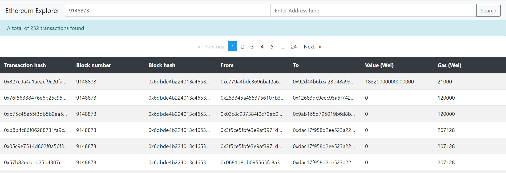

# Ethereum Explorer

The application allows users to search an Ethereum block for all the transactions associated with a block or an address within a block and return the results of the transaction.

## Development

### Development server

Run `ng serve` for a dev server. Navigate to `http://localhost:4200/`. The app will automatically reload if you change any of the source files.

### Build

Run `ng build` to build the project. The build artifacts will be stored in the `dist/` directory. Use the `--prod` flag for a production build.

### Running unit tests

Run `ng test` to execute the unit tests via [Karma](https://karma-runner.github.io).

### Running end-to-end tests

Run `ng e2e` to execute the end-to-end tests via [Protractor](http://www.protractortest.org/).

### Code scaffolding

Run `ng generate component component-name` to generate a new component. You can also use `ng generate directive|pipe|service|class|guard|interface|enum|module`.

## Usage

The following screen shows the transactions for a given block number.

## Important notes

For local testing of the app, run the local version of API (refer Ethereum API at https://github.com/iamsushantk/ethereum-api for setup details).

The transaction results are paged for better user experience.

The app uses back end api (refer my another project Ethereum API at https://github.com/iamsushantk/ethereum-api which in turn uses Infura API (refer https://infura.io/docs/ethereum)

Infura API has rate limit imposed (refer https://infura.io/pricing) which may also slow down the processing.
